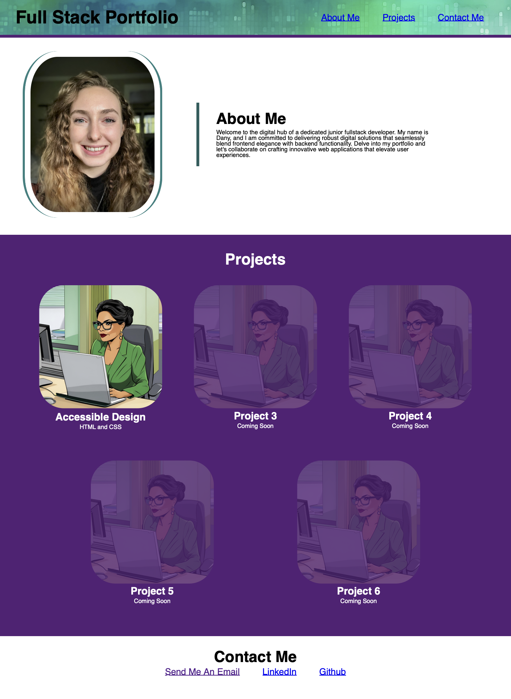

# My Professional Portfolio

## Description

This project is my portfolio webpage. I update it regularly to reflect the projects I wish to showcase.

I originally created this portfolio as the challenge assignment for Module 02 of the RICE Fullstack Coding Bootcamp. The objective was to consider accessibility and responsive design while building my landing page.

## Usage

This is the link to the deployed webpage: https://anullator.github.io/My-Professional-Portfolio/
